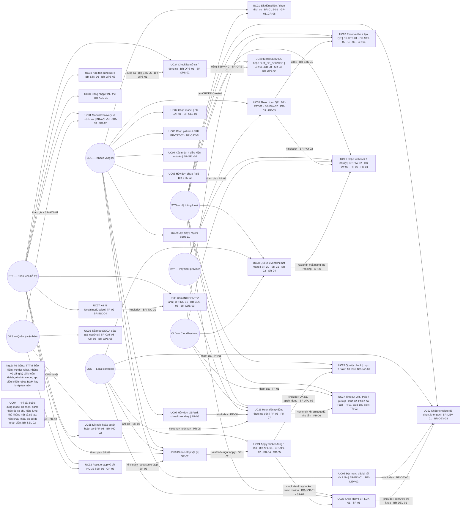
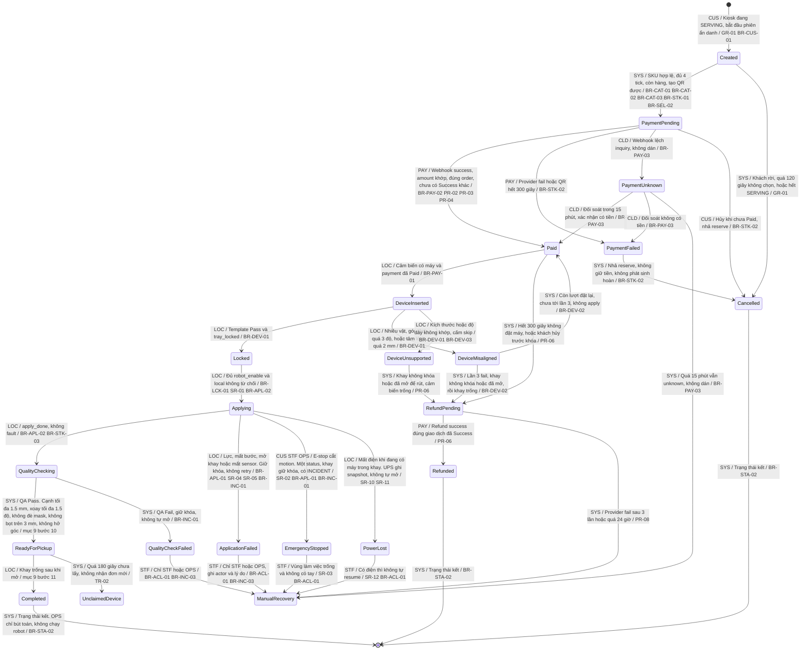
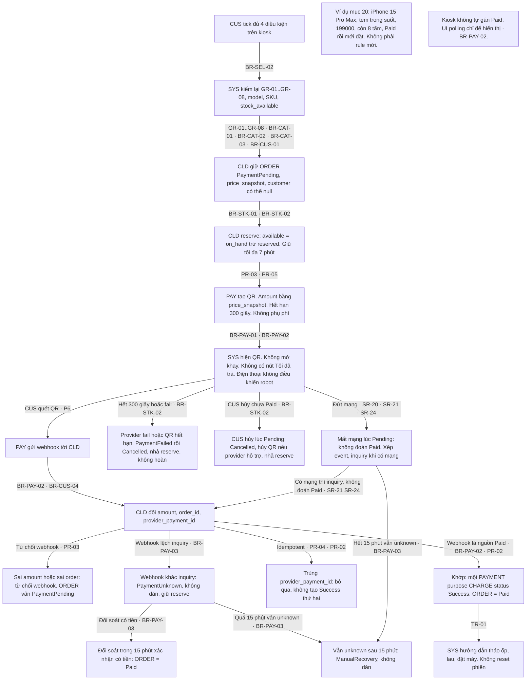
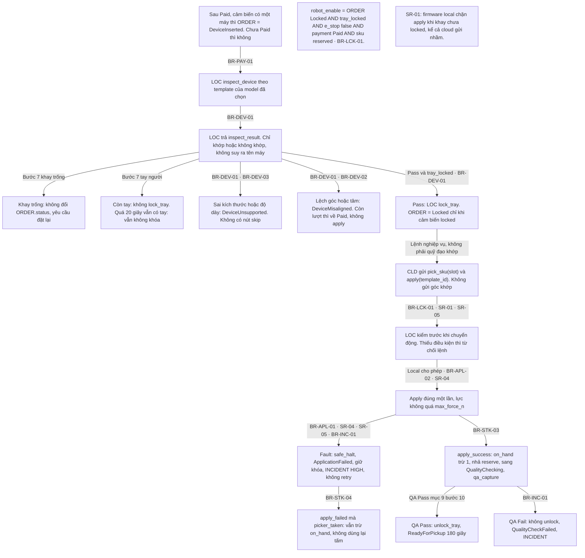
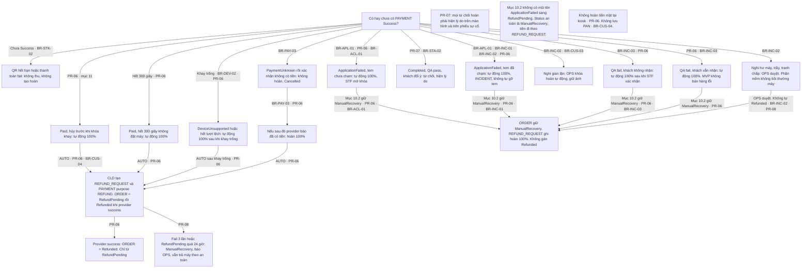
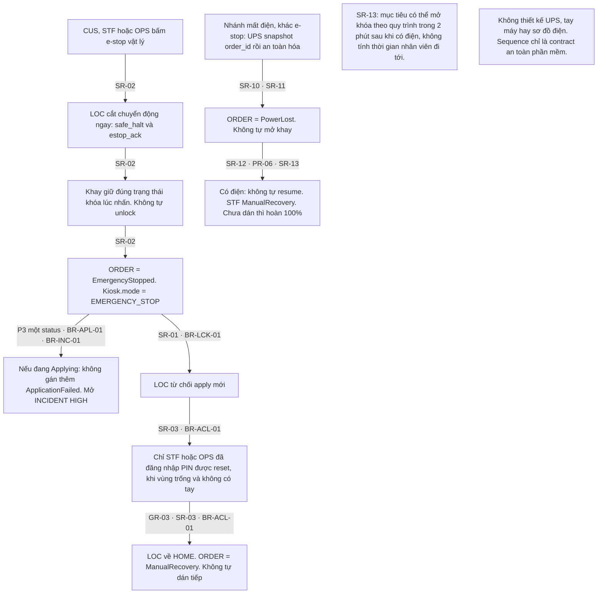

# StickerKiosk — SWD392 SE1927 Group 6

Kiosk tự phục vụ dán **sticker mặt lưng điện thoại**: khách chọn model trong whitelist, trả QR, đặt máy vào khay. Máy chỉ dán khi đơn **Paid** và khay **Locked**.

Trang này render đặc tả đã khóa (MVP v2) và các sơ đồ Mermaid. Bản vẽ cùng nội dung để mở bằng diagrams.net: [`diagrams/kiosk.drawio`](diagrams/kiosk.drawio). File Word gốc: [`DacTaNghiepVu_MVP_v2.docx`](DacTaNghiepVu_MVP_v2.docx).

Đây là seed đồ án (đặc tả, sơ đồ, backlog), không phải ứng dụng kiosk đang chạy.

## Mục lục

- [Phạm vi](#phạm-vi)
- [Nguyên tắc](#nguyên-tắc)
- [Actor](#actor)
- [Cổng được bán](#cổng-được-bán)
- [Luồng chuẩn](#luồng-chuẩn)
- [Trạng thái ORDER](#trạng-thái-order)
- [Thanh toán và hoàn tiền](#thanh-toán-và-hoàn-tiền)
- [Timeout](#timeout)
- [An toàn máy](#an-toàn-máy)
- [Sơ đồ](#sơ-đồ)
- [Backlog GitHub](#backlog-github)

## Phạm vi

Trong MVP: 3–5 model lưng phẳng, sticker cắt sẵn, một cổng VietQR, UI chính là màn kiosk, đo theo template kích thước đã chọn, khay khóa, e-stop, mở khóa bằng PIN nhân viên.

Ngoài MVP: in hoặc cắt tại chỗ, AI nhận model, máy có ốp hoặc lưng cong, app khách điều khiển robot, tiền mặt, thẻ, trả góp, phần mềm tự bồi thường giá điện thoại.

`ORDER.status` là nguồn sự thật nghiệp vụ. Local quyết định an toàn máy. Cloud quyết định tiền. Mất mạng không được ghi Paid khi chưa có xác nhận thanh toán.

## Nguyên tắc

| Mã | Nội dung |
|---|---|
| P1 | An toàn trước doanh thu |
| P2 | Không lấy tiền nếu không bán được dịch vụ. Lỗi hệ thống phải có đường hoàn |
| P3 | `ORDER.status` là trạng thái nghiệp vụ duy nhất |
| P4 | Local = an toàn máy. Cloud = tiền. Robot không nhận lệnh từ điện thoại khách |
| P5 | Khách ẩn danh là mặc định. SĐT tùy chọn, 10 số VN |
| P6 | UI chính là kiosk. Điện thoại chỉ quét QR |

## Actor

| Ký hiệu | Tên | Việc |
|---|---|---|
| CUS | Khách vãng lai | Chọn, tick 4 điều kiện, trả QR, đặt và lấy máy, bấm e-stop |
| SYS | Hệ thống kiosk | Cổng bán, UI, gọi cloud và local |
| LOC | Local controller | Khay, robot, cảm biến. Quyết định có được chạy robot |
| CLD | Cloud | Order, payment, refund, báo cáo |
| STF | Nhân viên hỗ trợ | PIN, sự cố, nạp tem, mở khóa |
| OPS | Quản lý vận hành | Giá, model, ngưỡng, duyệt hoàn tay |
| PAY | Payment provider | QR, Paid hoặc Failed, refund. Không lưu PAN |

## Cổng được bán

Kiosk chỉ `SERVING` khi đủ GR-01 đến GR-08. Thiếu một cổng thì `OUT_OF_SERVICE`, không nhận đơn mới.

| Mã | Điều kiện |
|---|---|
| GR-01 | `mode = SERVING` |
| GR-02 | Heartbeat local dưới 5 giây, cảm biến healthy |
| GR-03 | Robot ở HOME, không job dở, không fault |
| GR-04 | Khay trống, mở, không khóa |
| GR-05 | Còn ít nhất một SKU |
| GR-06 | Payment provider healthy |
| GR-07 | Cloud reachable. Mất cloud quá 2 phút khi chưa có đơn thì OOS |
| GR-08 | Đủ `max_force_n`, `align_tolerance_mm`, `qa_offset_max_mm` |

Catalog: BR-CAT-01 đến BR-CAT-05. Tồn: `available = on_hand - reserved` (BR-STK-01). Reserve khi tạo QR, giữ tối đa 7 phút (BR-STK-02).

## Luồng chuẩn

1. Khách bắt đầu. `ORDER = Created`, `origin = KIOSK`, không bắt buộc khách (BR-CUS-01).
2. Chọn model và pattern còn hàng (BR-CAT-01, BR-CAT-02). Giá khóa lúc xác nhận (BR-CAT-03). Vị trí dán là template SKU (BR-SEL-01).
3. Tick đủ 4 điều kiện. Hệ thống vẫn tự đo ở bước 7 (BR-SEL-02).
4. Reserve tồn và hiện QR 5 phút. Cấm đặt máy trước Paid (BR-PAY-01). Webhook mới là nguồn Paid (BR-PAY-02).
5. Paid thì mở cửa sổ đặt máy 5 phút. Sai số tiền thì từ chối webhook, đơn vẫn PaymentPending (PR-03). Webhook lệch inquiry thì PaymentUnknown (BR-PAY-03).
6. Cảm biến có máy thì `DeviceInserted`.
7. Đo theo template đã chọn, không nhận diện model (BR-DEV-01). Đặt lại tối đa 2 lần (BR-DEV-02). Cấm nút skip (BR-DEV-03).
8. Pass và `tray_locked` thì `Locked`.
9. Apply một lần khi đủ BR-LCK-01. Local từ chối nếu khay chưa khóa (SR-01).
10. QA Pass theo mục 9 bước 10 thì mở khay. `BR-CUS-05` chỉ là thời hạn giữ ảnh, không phải tiêu chí Pass.
11. Khay trống thì `Completed`. Quá 3 phút thì `UnclaimedDevice` (TR-02).

Bốn tick: đúng model đã chọn; đã hoặc sẽ tháo ốp và phụ kiện; lưng khô, không nứt, sẽ lau; hiểu khay khóa và sự cố do nhân viên mở.

## Trạng thái ORDER

Nhánh chính: `Created → PaymentPending → Paid → DeviceInserted → Locked → Applying → QualityChecking → ReadyForPickup → Completed`.

Nhánh kết hoặc lỗi: `PaymentFailed`, `PaymentUnknown`, `DeviceUnsupported`, `DeviceMisaligned`, `ApplicationFailed`, `QualityCheckFailed`, `PowerLost`, `NetworkDegraded`, `EmergencyStopped`, `ManualRecovery`, `RefundPending`, `Refunded`, `Cancelled`, `UnclaimedDevice`.

`NetworkDegraded` có tên ở mục 10.1 nhưng mục 10.2 không có transition của đơn. Mất mạng xử lý bằng SR-21, SR-22, SR-23, GR-07.

`Completed`, `Refunded`, `Cancelled` là trạng thái kết (BR-STA-02). Cấm nhảy cóc, ví dụ Paid sang Applying (BR-STA-01).

`ApplicationFailed` và `QualityCheckFailed` sang `ManualRecovery`. Hoàn 100% ghi ở `REFUND_REQUEST`, không gán `Refunded` từ hai trạng thái đó. Mục 10.2 không có lối `ManualRecovery → Refunded`.

## Thanh toán và hoàn tiền

Một đơn có nhiều `PAYMENT` (PR-01). Chỉ một bản ghi Success cho lần thu (PR-02). Amount QR bằng giá đã khóa (PR-03). Trùng `provider_payment_id` thì bỏ qua (PR-04). Không phụ phí (PR-05). Hoàn đúng giao dịch Success, không tiền mặt (PR-06). Từ chối hoàn phải hiện lý do (PR-07). `RefundPending` quá 24 giờ thì escalate OPS (PR-08).

| Tình huống | Kết quả |
|---|---|
| QR hết hạn hoặc thanh toán fail | Không thu, không hoàn |
| Paid, hủy trước khi khóa khay | Tự động 100% |
| Paid, hết 5 phút không đặt máy | Tự động 100% |
| Sai kích thước, còn ốp, hoặc hết lượt lệch | 100% sau khi khay trống |
| PaymentUnknown rồi xác nhận không có tiền | Không hoàn. Nếu sau đó provider báo có tiền thì hoàn 100% |
| Apply fail, tem chưa chạm hoặc đã chạm | 100% trên `REFUND_REQUEST`, đơn giữ `ManualRecovery` |
| QA fail | 100% trên `REFUND_REQUEST`, đơn giữ `ManualRecovery` |
| Completed, khách đổi ý | Từ chối |
| Hư máy, trầy, tranh chấp, nghi gian lận | OPS duyệt. Phần mềm không bồi thường máy |

## Timeout

Số trong bảng là `[MVP-DEFAULT]`. Đổi số thì phải sửa đặc tả, không sửa ngầm.

| Cửa sổ | Hết hạn |
|---|---|
| Created không chọn xong, 120 giây | Cancelled |
| QR, 300 giây | PaymentFailed, nhả reserve |
| Paid mà chưa có máy, 300 giây | RefundPending |
| Đặt lại khi lệch, 90 giây mỗi lần | Tính 1 lần fail. Hết 2 lần thì hoàn |
| ReadyForPickup, 180 giây | UnclaimedDevice |
| PaymentUnknown, 15 phút | ManualRecovery, không dán |
| Màn không chạm khi chưa Paid, 45 giây | Reset UI. Đã Paid thì không reset (TR-01) |
| Reserve tồn, 7 phút | Nhả reserve |

## An toàn máy

`robot_enable` khi đơn đang Locked, khay locked, e-stop tắt, payment Paid, và SKU còn reserve (BR-LCK-01). Local chặn apply nếu khay chưa khóa, kể cả cloud gửi nhầm (SR-01). E-stop cắt motion ngay, đơn `EmergencyStopped`, khay giữ nguyên khóa (SR-02). Chỉ STF hoặc OPS reset khi vùng trống (SR-03). Lực vượt `max_force_n` thì dừng (SR-04). Cấm apply khi camera hoặc cảm biến timeout (SR-05).

Mất điện: UPS ghi snapshot, `PowerLost`, không tự mở khay, không tự dán tiếp (SR-10, SR-11, SR-12).

## Sơ đồ

Mỗi cạnh state ghi `actor / điều kiện / mã`. Trang mất điện và e-stop là cùng một máy trạng thái, tách riêng cho dễ đọc.

### Use Case

Nguồn: `diagrams/mmd/UseCase.mmd`

### Activity — luồng mục 9

Nguồn: `diagrams/mmd/Activity.mmd`

```mermaid
flowchart TD
    A0["Bước 0 — Kiosk rảnh, chưa có ORDER"]
    D0["Đủ GR-01 đến GR-08?"]
    OOS["OUT_OF_SERVICE — không nhận đơn mới"]
    A1["Bước 1 — CUS bắt đầu. ORDER = Created, origin = KIOSK, customer_id null"]
    D120["Chọn xong trong 120 giây?"]
    CAN["ORDER = Cancelled"]
    A2["Bước 2 — Hiện model và pattern. Vị trí dán = template SKU, không chọn tự do"]
    DSTOCK["Còn SKU active, stock_available > 0?"]
    HIDE["Ẩn SKU, không tạo QR"]
    A3["Bước 3 — Tick đủ 4 điều kiện. Thiếu thì khóa nút Thanh toán"]
    A4["Bước 4 — Kiểm lại GR và tồn. PAYMENT Pending, reserve, QR 300 giây. Không mở khay"]
    DPAY["Kết quả thanh toán"]
    PAID["ORDER = Paid, started_insert_at = now. Cửa sổ đặt máy 300 giây"]
    PFAIL["ORDER = PaymentFailed, nhả reserve, không giữ tiền"]
    PUNK["ORDER = PaymentUnknown. Không dán. Giữ reserve tối đa 15 phút"]
    DREC["Đối soát webhook và inquiry"]
    MAN["ORDER = ManualRecovery. Chỉ STF hoặc OPS, có PIN"]
    DINS["Có máy trong khay trước 300 giây, hay khách hủy?"]
    INS["ORDER = DeviceInserted. Cảm biến có một máy và đã Paid"]
    REFP["ORDER = RefundPending. Hoàn 100%"]
    A7["Bước 7 — Đo so với template của phone_model_id. Không nhận diện model"]
    DDEV["Kết quả đo"]
    MIS["ORDER = DeviceMisaligned"]
    UNS["ORDER = DeviceUnsupported. Cấm skip"]
    DTRY["Còn lượt đặt lại? Chưa tới lần 3, mỗi lần 90 giây"]
    LOCK["Bước 8 — ORDER = Locked chỉ khi cảm biến tray_locked"]
    DLCK["BR-LCK-01 đủ để apply?"]
    NOAPP["Không gửi apply"]
    APP["Bước 9 — ORDER = Applying. Đúng 1 lần"]
    DAPP["Kết quả apply"]
    QA["Bước 10 — ORDER = QualityChecking"]
    APPF["ORDER = ApplicationFailed. Giữ khóa. INCIDENT HIGH. Không retry"]
    ESTOP["ORDER = EmergencyStopped. Khay giữ nguyên khóa"]
    DQA["QA đạt?"]
    QAF["ORDER = QualityCheckFailed. Giữ khóa. Không tự mở"]
    PICK["Bước 11 — Mở khay. ORDER = ReadyForPickup, 180 giây"]
    DPICK["Khay trống trong 180 giây?"]
    DONE["ORDER = Completed"]
    UNCL["ORDER = UnclaimedDevice. Không nhận đơn mới đến khi khay trống"]
    STFCHK["STF xác nhận máy còn hay không, chụp ảnh, đóng phiên. Không sang status mới ngoài mục 10.2"]
    PWR["ORDER = PowerLost. Không tự mở khay. Không tự resume"]
    REFD["ORDER = Refunded"]
    REJECT["Từ chối hoàn. Giữ Completed. Hiện lý do"]
    END["Kết phiên. BR-STA-02: Completed, Refunded, Cancelled không chạy robot lại"]
    A0 -->|"Kiểm cổng bán · GR-01 GR-02 GR-03 GR-04 GR-05 GR-06 GR-07 GR-08"| D0
    D0 -->|"Thiếu một cổng · GR-01..GR-08. Hết tem BR-OPS-04. Mất cloud quá 2 phút SR-23. Thiếu checklist BR-OPS-01"| OOS
    D0 -->|"Đủ cổng · CUS · BR-CUS-01"| A1
    A1 -->|"Mục 12 [MVP-DEFAULT] 120 giây. 45 giây không chạm thì reset UI, chưa Paid"| D120
    D120 -->|"Khách rời, quá 120 giây, hoặc hết SERVING · GR-01"| CAN
    D120 -->|"Còn trong hạn · BR-CAT-01 BR-CAT-02 BR-SEL-01 BR-CAT-04"| A2
    A2 -->|"Giá sẽ khóa lúc xác nhận · BR-CAT-03"| DSTOCK
    DSTOCK -->|"available = 0 hoặc SKU inactive · BR-CAT-02 BR-STK-05 BR-CAT-05"| HIDE
    DSTOCK -->|"Còn hàng · BR-SEL-02. Tick không thay được bước đo"| A3
    A3 -->|"Đủ 4 tick · SYS kiểm lại GR và stock_available · BR-STK-01 BR-PAY-01 PR-03 PR-05"| A4
    A4 -->|"QR hiện, khay không mở · BR-PAY-01 BR-PAY-02"| DPAY
    DPAY -->|"PAY webhook success, amount khớp, đúng một Success · BR-PAY-02 PR-02 PR-03 PR-04"| PAID
    DPAY -->|"Provider fail hoặc QR hết 300 giây · BR-STK-02"| PFAIL
    DPAY -->|"Webhook lệch inquiry · BR-PAY-03"| PUNK
    DPAY -->|"CUS hủy khi chưa Paid, nhả reserve · BR-STK-02"| CAN
    PFAIL -->|"Không thu nên không hoàn · BR-STK-02"| CAN
    PUNK -->|"Không dán, không đoán Paid · BR-PAY-03 SR-21"| DREC
    DREC -->|"Đối soát trong 15 phút, có tiền · BR-PAY-03"| PAID
    DREC -->|"Đối soát không có tiền · BR-PAY-03"| PFAIL
    DREC -->|"Quá 15 phút vẫn unknown, không dán · BR-PAY-03"| MAN
    PAID -->|"Cửa sổ đặt máy 300 giây. Đã Paid thì không reset để phục vụ khách khác · TR-01"| DINS
    DINS -->|"Hết 300 giây không đặt, hoặc CUS hủy trước khóa · PR-06"| REFP
    DINS -->|"Cảm biến có một máy. Chưa Paid thì không gán DeviceInserted · BR-PAY-01"| INS
    INS -->|"Đo template của model đã chọn · BR-DEV-01"| A7
    A7 -->|"So template đã chọn. Cấm nút skip · BR-DEV-03"| DDEV
    DDEV -->|"Khay trống hoặc còn tay người: không đổi status, không khóa · BR-DEV-01"| A7
    DDEV -->|"Nhiều vật, góc yaw trên 3 độ, hoặc lệch tâm trên 2 mm · BR-DEV-01"| MIS
    DDEV -->|"WxH lệch quá ±1.5 mm hoặc dày hơn template + 1.0 mm · BR-DEV-01 BR-DEV-03"| UNS
    DDEV -->|"Khớp template và tray_locked · BR-DEV-01"| LOCK
    MIS -->|"Mỗi lần lệch tính 1 fail, hạn 90 giây · BR-DEV-02"| DTRY
    DTRY -->|"Còn lượt, chưa tới lần 3. Về cửa sổ Paid, không apply · BR-DEV-02"| PAID
    DTRY -->|"Lần 3 fail, khay không khóa hoặc đã mở, cảm biến trống · BR-DEV-02"| REFP
    UNS -->|"Khay trống sau khi mở để rút · PR-06"| REFP
    LOCK -->|"robot_enable cần Locked, tray_locked, e_stop false, Paid, sku reserved · BR-LCK-01 SR-01"| DLCK
    DLCK -->|"Thiếu một điều kiện, kể cả cloud gửi nhầm · SR-01 SR-05"| NOAPP
    DLCK -->|"Local chấp nhận. Tối đa 1 apply · BR-APL-02"| APP
    APP -->|"Lực không vượt max_force_n · SR-04"| DAPP
    DAPP -->|"apply_done, không fault. on_hand trừ 1, nhả reserve · BR-STK-03 BR-APL-02"| QA
    DAPP -->|"Lực, mất bước, mở khay, mất sensor. Giữ khóa · BR-APL-01 SR-04 SR-05 BR-INC-01"| APPF
    DAPP -->|"E-stop. Một status EmergencyStopped, vẫn INCIDENT · SR-02 BR-APL-01 BR-INC-01"| ESTOP
    APP -->|"Mất điện khi đang có máy · SR-10 SR-11"| PWR
    LOCK -->|"Mất điện · SR-10 SR-11"| PWR
    LOCK -->|"E-stop, khay giữ khóa · SR-02"| ESTOP
    QA -->|"Cạnh tối đa 1.5 mm, xoay tối đa 1.5 độ, không đè mask, không bọt trên 3 mm, không hở góc · mục 9 bước 10"| DQA
    DQA -->|"QA Pass. Cạnh tối đa 1.5 mm, xoay tối đa 1.5 độ · mục 9 bước 10"| PICK
    DQA -->|"QA Fail · BR-INC-01"| QAF
    QAF -->|"Chỉ STF/OPS · BR-ACL-01 BR-INC-03"| MAN
    APPF -->|"Chỉ STF/OPS. Picker taken vẫn trừ on_hand · BR-ACL-01 BR-STK-04"| MAN
    APPF -->|"E-stop, khay giữ khóa · SR-02"| ESTOP
    QAF -->|"E-stop, khay giữ khóa · SR-02"| ESTOP
    PICK -->|"Cửa sổ lấy máy 180 giây · mục 12"| DPICK
    DPICK -->|"Khay trống · mục 9 bước 11"| DONE
    DPICK -->|"Quá 180 giây · TR-02"| UNCL
    PICK -->|"Mất điện · SR-11"| PWR
    PWR -->|"Có điện không tự resume. STF xác nhận máy · SR-12 BR-ACL-01"| MAN
    ESTOP -->|"Reset chỉ khi vùng trống, không có tay · SR-03 BR-ACL-01"| MAN
    REFP -->|"Provider refund success, đúng giao dịch, không tiền mặt · PR-06"| REFD
    REFP -->|"Refund fail 3 lần hoặc quá 24 giờ · PR-08"| MAN
    DONE -->|"Khách đổi ý sau QA Pass · PR-07 BR-STA-02"| REJECT
    DONE -->|"Kết · BR-STA-02"| END
    REFD -->|"Kết · BR-STA-02"| END
    CAN -->|"Kết · BR-STA-02"| END
    UNCL -->|"STF xác nhận, không đổi status ngoài mục 10.2 · TR-02 BR-INC-04"| STFCHK
    NOTE_108["BR-STA-01: cấm nhảy cóc, ví dụ Paid sang Applying hoặc Created sang Locked. Activity đi đúng cổng mục 9."]
    NOTE_109["P4: local quyết định an toàn máy, cloud quyết định tiền. Mất mạng lúc Pending không bịa Paid · SR-20 SR-21."]
    NOTE_110["ApplicationFailed và QualityCheckFailed sang ManualRecovery theo mục 10.2. Hoàn 100% ghi ở REFUND_REQUEST theo mục 11, không thêm status ngoài bảng 10.2."]
    NOTE_111["4 tick: đúng model đã chọn; tháo ốp và phụ kiện; lưng khô không nứt sẽ lau; hiểu khay khóa và sự cố do nhân viên."]
```

### State ORDER — nhánh mục 10.2

Nguồn: `diagrams/mmd/State-ORDER.mmd`

### State ORDER — mất điện và e-stop

Nguồn: `diagrams/mmd/State-Ngat.mmd`

```mermaid
stateDiagram-v2
    direction TB
    %% Cùng máy trạng thái ORDER. Trang này chỉ ngắt điện và e-stop hàng loạt.
    DeviceInserted --> PowerLost: LOC / Mất điện khi đang có máy trong khay. UPS ghi snapshot, không tự mở / SR-10 SR-11
    DeviceMisaligned --> PowerLost: LOC / Mất điện khi đang có máy trong khay. UPS ghi snapshot, không tự mở / SR-10 SR-11
    DeviceUnsupported --> PowerLost: LOC / Mất điện khi đang có máy trong khay. UPS ghi snapshot, không tự mở / SR-10 SR-11
    Locked --> PowerLost: LOC / Mất điện khi đang có máy trong khay. UPS ghi snapshot, không tự mở / SR-10 SR-11
    QualityChecking --> PowerLost: LOC / Mất điện khi đang có máy trong khay. UPS ghi snapshot, không tự mở / SR-10 SR-11
    ReadyForPickup --> PowerLost: LOC / Mất điện khi đang có máy trong khay. UPS ghi snapshot, không tự mở / SR-10 SR-11
    ApplicationFailed --> PowerLost: LOC / Mất điện khi đang có máy trong khay. UPS ghi snapshot, không tự mở / SR-10 SR-11
    QualityCheckFailed --> PowerLost: LOC / Mất điện khi đang có máy trong khay. UPS ghi snapshot, không tự mở / SR-10 SR-11
    UnclaimedDevice --> PowerLost: LOC / Mất điện khi đang có máy trong khay. UPS ghi snapshot, không tự mở / SR-10 SR-11
    EmergencyStopped --> PowerLost: LOC / Mất điện khi đang có máy trong khay. UPS ghi snapshot, không tự mở / SR-10 SR-11
    ManualRecovery --> PowerLost: LOC / Mất điện khi đang có máy trong khay. UPS ghi snapshot, không tự mở / SR-10 SR-11
    Created --> EmergencyStopped: CUS STF OPS / E-stop cắt motion, khay giữ nguyên khóa / SR-02
    PaymentPending --> EmergencyStopped: CUS STF OPS / E-stop cắt motion, khay giữ nguyên khóa / SR-02
    Paid --> EmergencyStopped: CUS STF OPS / E-stop cắt motion, khay giữ nguyên khóa / SR-02
    DeviceInserted --> EmergencyStopped: CUS STF OPS / E-stop cắt motion, khay giữ nguyên khóa / SR-02
    DeviceMisaligned --> EmergencyStopped: CUS STF OPS / E-stop cắt motion, khay giữ nguyên khóa / SR-02
    DeviceUnsupported --> EmergencyStopped: CUS STF OPS / E-stop cắt motion, khay giữ nguyên khóa / SR-02
    Locked --> EmergencyStopped: CUS STF OPS / E-stop cắt motion, khay giữ nguyên khóa / SR-02
    QualityChecking --> EmergencyStopped: CUS STF OPS / E-stop cắt motion, khay giữ nguyên khóa / SR-02
    ReadyForPickup --> EmergencyStopped: CUS STF OPS / E-stop cắt motion, khay giữ nguyên khóa / SR-02
    UnclaimedDevice --> EmergencyStopped: CUS STF OPS / E-stop cắt motion, khay giữ nguyên khóa / SR-02
    ApplicationFailed --> EmergencyStopped: CUS STF OPS / E-stop cắt motion, khay giữ nguyên khóa / SR-02
    QualityCheckFailed --> EmergencyStopped: CUS STF OPS / E-stop cắt motion, khay giữ nguyên khóa / SR-02
```

### Sequence thanh toán

Nguồn: `diagrams/mmd/Seq-ThanhToan.mmd`

### Sequence interlock

Nguồn: `diagrams/mmd/Seq-Interlock.mmd`

### Sequence hoàn tiền

Nguồn: `diagrams/mmd/Seq-HoanTien.mmd`

### Sequence e-stop và mất điện

Nguồn: `diagrams/mmd/Seq-EStop.mmd`

### ERD Trang-4

Nguồn: `diagrams/mmd/Trang-4.mmd`

```mermaid
erDiagram
    PHONE_MODEL {
        string phone_model_id PK
        string name
        string is_supported "BR-CAT-01"
        string width_mm
        string height_mm
        string thickness_mm
        string camera_mask
        string align_template_uri "BR-DEV-01"
        string qa_offset_max_mm "GR-08"
    }
    STICKER_PATTERN {
        string sticker_pattern_id PK
        string name
        string preview_uri
    }
    STICKER_ITEM {
        string sticker_item_id PK
        string sticker_pattern_id FK
        string phone_model_id FK
        string price "BR-CAT-03"
        string estimated_seconds "BR-CAT-04"
        string active "BR-CAT-05"
        string slot_code "mục 18"
    }
    KIOSK {
        string kiosk_id PK
        string mode "GR-01 SERVING OUT_OF_SERVICE MAINTENANCE EMERGENCY_STOP"
        string max_force_n "GR-08 SR-04"
        string align_tolerance_mm "GR-08"
        string qa_offset_max_mm "GR-08"
        string force_maintenance "BR-OPS-05"
        string last_heartbeat_at "GR-02"
    }
    KIOSK_STOCK {
        string kiosk_stock_id PK
        string kiosk_id FK
        string sticker_item_id FK
        string stock_natural_key UK "unique kiosk_id và sticker_item_id"
        string on_hand
        string reserved "BR-STK-01"
        string reorder_threshold "BR-STK-05"
        string slot_code "BR-OPS-03"
    }
    CUSTOMER {
        string customer_id PK
        string phone_vn "nullable BR-CUS-02"
    }
    KIOSK_SESSION {
        string session_id PK
        string kiosk_id FK
        string anonymous "BR-CUS-01"
        string started_at
        string last_touch_at "mục 12"
    }
    ORDER {
        string order_id PK
        string status "enum mục 10.1 BR-STA-01"
        string kiosk_id FK
        string phone_model_id FK
        string sticker_item_id FK
        string customer_id FK "nullable BR-CUS-01"
        string session_id FK
        string price_snapshot "BR-CAT-03"
        string attempt_align_count "BR-DEV-02"
        string phone_optional "BR-CUS-02"
        string started_insert_at
        string origin "KIOSK"
    }
    PAYMENT {
        string payment_id PK
        string order_id FK "PR-01"
        string provider_payment_id UK "PR-04"
        string provider
        string amount "PR-03 PR-05"
        string status
        string purpose "CHARGE hoặc REFUND"
        string paid_at "BR-CUS-04 không lưu PAN"
    }
    PAYMENT_WEBHOOK_LOG {
        string webhook_id PK
        string payment_id FK "nullable"
        string provider_payment_id
        string amount
        string accepted
        string reason "BR-PAY-03"
        string received_at "BR-PAY-02"
    }
    TRANSACTION_STATE_LOG {
        string log_id PK
        string order_id FK
        string kiosk_id FK "BR-ACL-01"
        string from_status
        string to_status
        string actor_type
        string actor_id "BR-ACL-01"
        string reason
        string rule_code
        string at
    }
    DEVICE_INSPECTION {
        string inspection_id PK
        string order_id FK
        string attempt_no "BR-DEV-02"
        string result "PASS EMPTY MISALIGNED UNSUPPORTED HAND"
        string width_delta_mm
        string yaw_deg
        string center_offset_mm
        string thickness_delta_mm
        string photo_uri "BR-CUS-03"
        string at
    }
    QUALITY_CHECK {
        string quality_check_id PK
        string order_id FK
        string offset_mm
        string rotation_deg
        string camera_clear
        string bubble_ok
        string edge_ok
        string sku_code_match
        string pass
        string photo_uri "BR-CUS-05"
        string checked_at
    }
    ROBOT_ARM {
        string robot_arm_id PK
        string kiosk_id FK
        string state
        string at_home "GR-03"
        string fault "GR-03"
        string scope "chỉ interface local, không lưu góc khớp"
    }
    ROBOT_EVENT_LOG {
        string event_id PK
        string robot_arm_id FK
        string kiosk_id FK
        string order_id FK "nullable"
        string event_type
        string force_n "SR-04"
        string sku_slot
        string picker_taken "BR-STK-04"
        string tray_locked "SR-01"
        string e_stop "SR-02"
        string at
    }
    STAFF {
        string staff_id PK
        string role "STF hoặc OPS"
        string pin_hash "BR-ACL-01"
        string display_name
    }
    STAFF_ACTION_LOG {
        string action_id PK
        string staff_id FK
        string kiosk_id FK
        string order_id FK "nullable"
        string action
        string reason "BR-ACL-01"
        string at
    }
    INCIDENT_REPORT {
        string incident_id PK
        string order_id FK "BR-INC-01"
        string kiosk_id FK
        string robot_arm_id FK "nullable"
        string staff_id FK "nullable"
        string level
        string photo_uris "BR-CUS-05"
        string force_log_ref
        string tray_has_device "BR-INC-03"
        string sticker_contacted "BR-INC-03"
        string customer_present "BR-INC-03"
        string handover_external "BR-INC-04"
        string opened_at
    }
    REFUND_REQUEST {
        string refund_request_id PK
        string order_id FK
        string payment_id FK "PR-06"
        string requested_by_staff_id FK "nullable"
        string approved_by_staff_id FK "nullable"
        string amount
        string mode "AUTO hoặc MANUAL"
        string status
        string reason_code
        string reject_reason "PR-07"
        string attempt_count "PR-08"
    }
    MAINTENANCE_LOG {
        string maintenance_id PK
        string kiosk_id FK
        string staff_id FK
        string robot_arm_id FK "nullable"
        string kiosk_stock_id FK "nullable"
        string log_type "RESTOCK CLEAN CHECKLIST SERVICE"
        string note "BR-STK-06 BR-OPS-01"
        string at
    }
    PHONE_MODEL ||--o{ STICKER_ITEM : "mỗi model 0..* SKU · mỗi SKU đúng 1 model · BR-CAT-01"
    STICKER_PATTERN ||--o{ STICKER_ITEM : "mỗi mẫu 0..* SKU · mỗi SKU đúng 1 mẫu"
    KIOSK ||--o{ KIOSK_STOCK : "mỗi kiosk 0..* dòng tồn · BR-STK-01"
    STICKER_ITEM ||--o{ KIOSK_STOCK : "mỗi SKU 0..* tồn theo kiosk · BR-STK-05"
    CUSTOMER |o--o{ ORDER : "mỗi đơn 0..1 khách · mỗi khách 0..* đơn · BR-CUS-01"
    PHONE_MODEL ||--o{ ORDER : "mỗi đơn đúng 1 model đã chọn · BR-SEL-01"
    STICKER_ITEM ||--o{ ORDER : "mỗi đơn đúng 1 SKU · giá chụp lúc tạo · BR-CAT-03"
    KIOSK ||--o{ ORDER : "mỗi đơn đúng 1 kiosk"
    KIOSK ||--o{ KIOSK_SESSION : "mỗi kiosk 0..* phiên · BR-CUS-01"
    KIOSK_SESSION ||--o| ORDER : "mỗi phiên 0..1 đơn · mỗi đơn đúng 1 phiên"
    ORDER ||--o{ PAYMENT : "mỗi đơn 0..* payment · chỉ 1 Success · PR-01 PR-02"
    PAYMENT |o--o{ PAYMENT_WEBHOOK_LOG : "webhook có thể chưa ghép payment · BR-PAY-02 PR-04"
    ORDER ||--o{ TRANSACTION_STATE_LOG : "vết status, không mâu ORDER.status · BR-STA-01"
    KIOSK ||--o{ TRANSACTION_STATE_LOG : "log ghi kiosk_id · BR-ACL-01"
    ORDER ||--o{ DEVICE_INSPECTION : "mỗi lần đo bước 7 · BR-DEV-01"
    ORDER ||--o{ QUALITY_CHECK : "kết quả QA mục 9 bước 10"
    KIOSK ||--|{ ROBOT_ARM : "mỗi kiosk 1..* tay qua interface · GR-03"
    ROBOT_ARM ||--o{ ROBOT_EVENT_LOG : "sự kiện local"
    KIOSK ||--o{ ROBOT_EVENT_LOG : "event tại kiosk"
    ORDER |o--o{ ROBOT_EVENT_LOG : "event có thể chưa gắn đơn"
    STAFF ||--o{ STAFF_ACTION_LOG : "audit người dùng · BR-ACL-01"
    ORDER |o--o{ STAFF_ACTION_LOG : "thao tác có thể không gắn đơn"
    KIOSK ||--o{ STAFF_ACTION_LOG : "thao tác tại kiosk · BR-ACL-01"
    STAFF |o--o{ INCIDENT_REPORT : "có thể chưa gán nhân viên · BR-INC-03"
    ORDER ||--o{ INCIDENT_REPORT : "sự cố gắn đơn · BR-INC-01"
    KIOSK ||--o{ INCIDENT_REPORT : "hiện trường"
    ROBOT_ARM |o--o{ INCIDENT_REPORT : "nguồn lực nếu có · BR-APL-01"
    ORDER ||--o{ REFUND_REQUEST : "một đơn nhiều yêu cầu hoàn"
    PAYMENT ||--o{ REFUND_REQUEST : "hoàn đúng giao dịch Success · PR-06"
    STAFF |o--o{ REFUND_REQUEST : "nhánh tay · PR-08"
    STAFF ||--o{ MAINTENANCE_LOG : "người thực hiện · BR-OPS-01"
    KIOSK ||--o{ MAINTENANCE_LOG : "BR-OPS-05"
    ROBOT_ARM |o--o{ MAINTENANCE_LOG : "bảo trì interface, không phải BOM"
    KIOSK_STOCK |o--o{ MAINTENANCE_LOG : "RESTOCK · BR-STK-06"
```

## Backlog GitHub

| Việc | Lệnh |
|---|---|
| Xem kế hoạch issue, không gọi GitHub | `python3 scripts/github-sync.py` |
| Tạo issue và Project | Điền `.env` từ `.env.example`, đặt `GITHUB_PROJECT_DRY_RUN=false`, rồi chạy lại script |

Script mặc định chỉ in kế hoạch. Không commit `.env` hoặc token.

- [Blueprint](docs/blueprint/stickerkiosk-blueprint.md)
- [Kế hoạch đồng bộ](docs/github/sync-plan.md)
- [Backlog](requirements/backlog.py)
- [Handoff](CURSOR_HANDOFF_SWD392.md)
