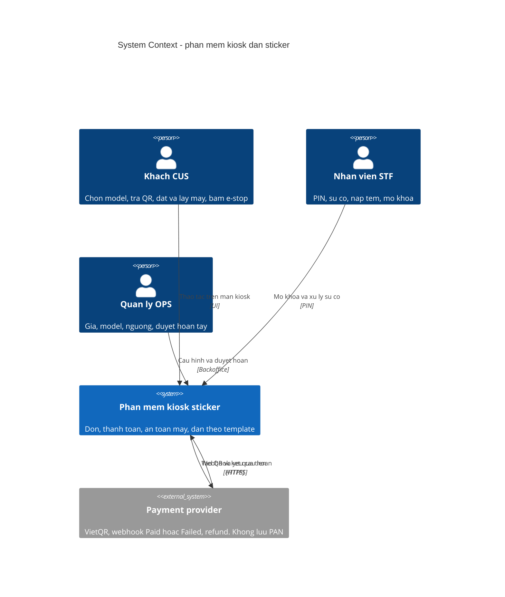

# 3. Bối cảnh và phạm vi

Sơ đồ mức 1 của C4. Hệ thống phần mềm là một hộp. Người và payment provider đứng ngoài.

Nguồn: `diagrams/mmd/C4-Context.mmd`.

TTTM, bảo hiểm và vendor robot không nối vào hệ thống. Bàn giao máy thất lạc cho bảo vệ TTTM ghi `handover_external` (BR-INC-04), không có API điều khiển robot.

Trong phạm vi: UI kiosk, cloud đơn và tiền, local an toàn máy, cơ sở dữ liệu đơn.

Ngoài phạm vi: firmware khớp, cơ khí, bồi thường giá điện thoại.
