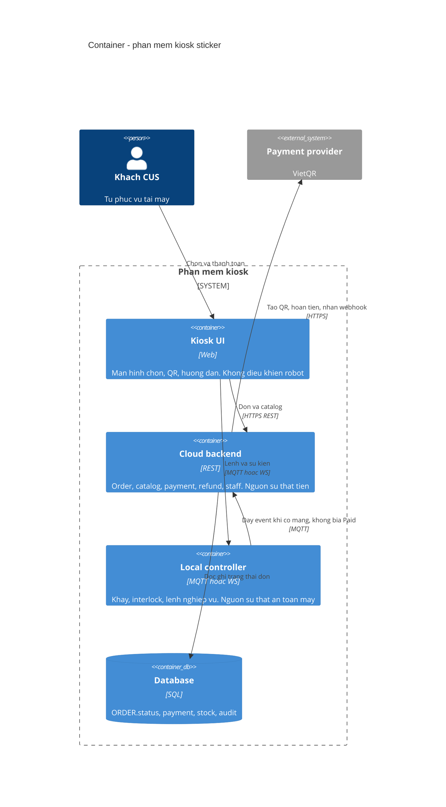
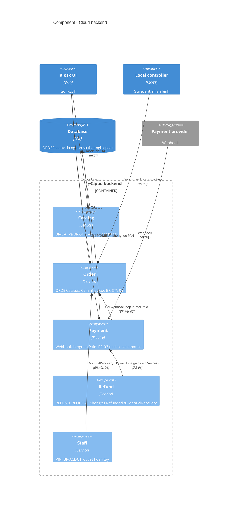
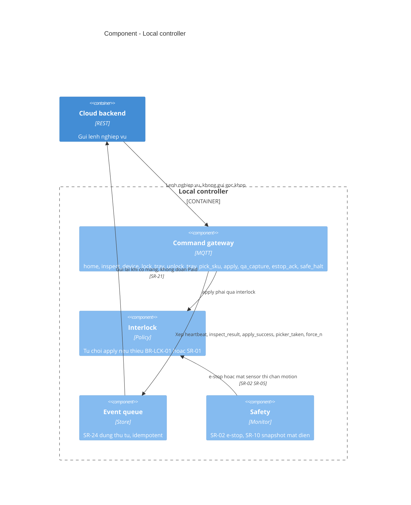

# 5. Khối xây dựng

Mức 2 và mức 3 của C4. Mức 4 (lớp code) chưa có vì repo chưa chứa ứng dụng kiosk.

## 5.1 Container

Nguồn: `diagrams/mmd/C4-Container.mmd`.

## 5.2 Component cloud

Nguồn: `diagrams/mmd/C4-Component-Cloud.mmd`.

## 5.3 Component local

Nguồn: `diagrams/mmd/C4-Component-Local.mmd`.

ERD các bảng nằm ở `diagrams/mmd/Trang-4.mmd`, không lặp lại ở đây.
