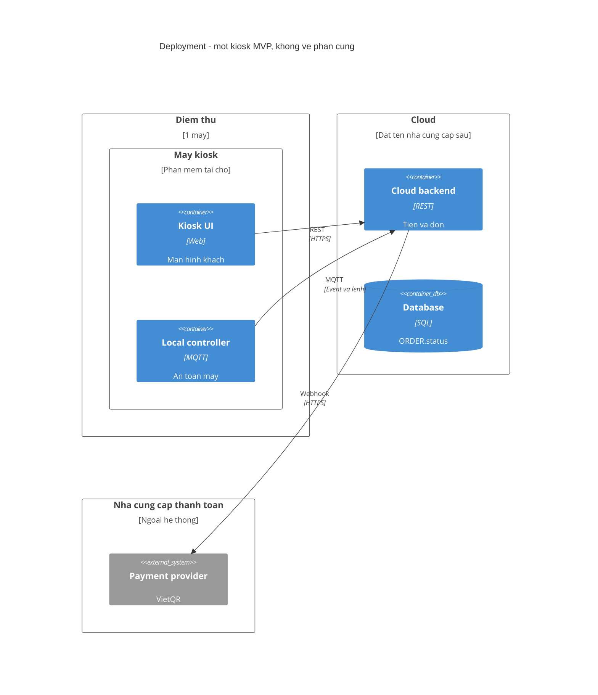

# 7. Triển khai

Một điểm thử, một máy. Sơ đồ này là nút phần mềm, không phải bản vẽ cơ khí.

Nguồn: `diagrams/mmd/C4-Deployment.mmd`.

UI và local cùng một máy kiosk để mất mạng vẫn giữ an toàn máy (SR-20, SR-22). Cloud và database ở ngoài máy. Payment provider là hệ thống ngoài.
